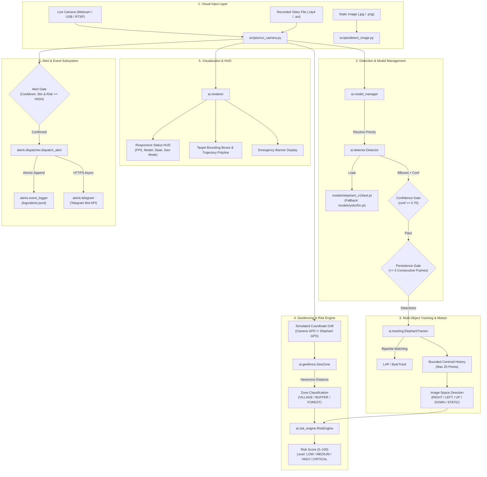

# Project Zogan

> An AI-assisted wildlife monitoring prototype for elephant detection, multi-target tracking, simulated geofenced risk assessment, and automated incident alerting.

[](https://www.python.org/)
[](https://github.com/pritesh-4/Project_Z-gan/actions/workflows/ci.yml)
[](tests/)
[](https://github.com/astral-sh/ruff)
[](datasets/elephant/)

---

## Table of Contents

- [Overview](#overview)
- [Problem Context](#problem-context)
- [System Goals](#system-goals)
- [Current Capabilities](#current-capabilities)
- [Hardware vs. Software Reality](#hardware-vs-software-reality)
- [System Architecture](#system-architecture)
- [Technology Stack](#technology-stack)
- [Repository Structure](#repository-structure)
- [Installation & Environment Setup](#installation--environment-setup)
- [Quick Start & Usage](#quick-start--usage)
- [Machine Learning & Computer Vision Pipeline](#machine-learning--computer-vision-pipeline)
- [Multi-Object Tracking & Motion Analysis](#multi-object-tracking--motion-analysis)
- [Geofencing & Spatial Risk Engine](#geofencing--spatial-risk-engine)
- [Alerting & Incident Logging Subsystem](#alerting--incident-logging-subsystem)
- [Configuration Reference](#configuration-reference)
- [Testing & Quality Assurance](#testing--quality-assurance)
- [Limitations & Honest Engineering Constraints](#limitations--honest-engineering-constraints)
- [Roadmap & Future Work](#roadmap--future-work)
- [Contributing](#contributing)
- [License & Acknowledgments](#license--acknowledgments)

---

## Overview

**Project Zogan** is an open-source engineering and research prototype designed to evaluate computer vision, multi-target tracking, and rule-based spatial risk modeling for wildlife monitoring along forest-village fringes. Its primary objective is to detect elephants in monocular video feeds, verify detection persistence across consecutive frames, estimate motion trajectories, calculate proximity to defined safety perimeters, and dispatch structured alert events.

The project is structured as a modular Python pipeline that bridges deep learning inference (Ultralytics YOLO) with spatial evaluation (Haversine geodesic math) and multi-channel alerting (atomic JSON Lines event logs and asynchronous Telegram notifications).

```
Visual Input (Camera / Video)
           │
           ▼
  YOLO Elephant Detector (Custom elephant_v1 / COCO Baseline)
           │
           ▼
  Temporal Persistence Gate (>= 5 Consecutive Frames)
           │
           ▼
  ByteTrack Multi-Object Tracker (Session ID + Centroid Trail)
           │
           ▼
  Spatial & Geofence Engine (Haversine Distance + Zone Classification)
           │
           ▼
  Rule-Based Risk Engine (LOW / MEDIUM / HIGH / CRITICAL)
           │
           ▼
  Unified Alert Dispatcher ──► Local Event Log (logs/alerts.jsonl)
                           └──► Telegram Bot API (Remote Alerts)
```

> **Engineering Status**: Project Zogan is currently a **software-only research prototype and field evaluation platform**. It is **not** an autonomous life-safety system, certified perimeter defense product, or field-hardened hardware appliance. All geographic coordinates and animal distances are currently simulated in software unless integrated with calibrated ranging sensors.

---

## Problem Context

Human-elephant conflict (HEC) is an escalating conservation and humanitarian challenge across agricultural frontiers and wildlife migration corridors. Crop raiding, property damage, and dangerous encounters frequently occur when herds exit protected reserves into human settlements.

Traditional monitoring approaches face fundamental operational bottlenecks:
- **Passive Camera Traps**: Capture high-resolution records but operate offline, requiring physical memory card retrieval and offering zero real-time warning value.
- **Manual Patrols**: Expensive, dangerous during nighttime hours, and unable to maintain continuous 360-degree observation.
- **Single-Frame Computer Vision**: Standard object detectors produce transient false positives from optical occlusion, motion blur, and background clutter, causing alarm fatigue if wired directly to sirens or notification channels.

Project Zogan addresses these issues at a software architecture level:
1. **Multi-Frame Verification**: Requires $N$ consecutive positive frames before confirming an incident.
2. **Contextual Risk Evaluation**: Evaluates not merely detection, but spatial proximity, approach vectors, and herd group size.
3. **Structured Incident Records**: Emits machine-readable event objects with auditable metadata rather than unformatted messages.

---

## System Goals

| Goal | Engineering Focus | Implementation Status |
|:---|:---|:---|
| **Elephant Detection** | Detect elephants from RGB video and still imagery using specialized deep learning. | Implemented (`ai/detector.py`, `models/elephant_v1/best.pt`) |
| **Persistence Filtering** | Prevent transient false alarms by requiring consecutive positive detection frames. | Implemented (`config.REQUIRED_DETECTIONS = 5`) |
| **Multi-Object Tracking** | Maintain persistent session IDs and historical trajectories across video frames. | Implemented via ByteTrack (`ai/tracking.py`) |
| **Movement Analysis** | Estimate 2D image-space velocity vectors with deadband jitter suppression. | Implemented (`DIRECTION_RIGHT`, `LEFT`, `UP`, `DOWN`) |
| **Geofenced Risk Assessment** | Calculate geodesic distance to protected settlements and classify risk levels. | Implemented in software simulation (`ai/geofence.py`, `ai/risk_engine.py`) |
| **Multi-Channel Alerting** | Record audit records locally and dispatch remote alerts with fail-safe error isolation. | Implemented (`alerts/event_logger.py`, `alerts/telegram.py`) |
| **Rigorous Testing & CI** | Ensure mathematical and operational correctness via automated quality gates. | Implemented (81 tests passing, Ruff linting, GitHub Actions CI) |

---

## Current Capabilities

| Component | Status | Description | Implementation Details |
|:---|:---:|:---|:---|
| **YOLO Elephant Detection** | **Implemented** | Single-class elephant detection using custom weights and fallback COCO baseline. | `ai/detector.py`, `ai/model_manager.py` |
| **Custom Model (`elephant_v1`)** | **Implemented** | Fine-tuned YOLO26n model trained on 456 images with background negative samples. | `models/elephant_v1/best.pt` (mAP@50: 88.2%) |
| **Image CLI Detection** | **Implemented** | Standalone command-line inference tool for single images with annotated outputs. | `scripts/detect_image.py`, `ai/predict_custom.py` |
| **Real-Time Video Orchestrator** | **Implemented** | Multi-threaded video loop supporting webcams, RTSP streams, and local video files. | `scripts/run_camera.py` |
| **Object Tracking (ByteTrack)** | **Implemented** | Two-stage bipartite matching using LAP linear assignment solver for session tracking. | `ai/tracking.py` (via `lap`) |
| **Image-Space Motion Analysis** | **Implemented** | Rolling window centroid tracking with 10px deadband anti-jitter filtering. | `ai/tracking.py` |
| **Geofencing Engine** | **Implemented** | Great-circle Haversine geodesic distance calculation and concentric/polygon zone classification. | `ai/geofence.py` |
| **Rule-Based Risk Engine** | **Implemented** | Multi-factor risk scoring (0–100) factoring zone, distance, approach trend, and herd size. | `ai/risk_engine.py` |
| **Spatial Drift Simulation** | **Simulated** | Dynamic coordinate drift and course adjustment to test geofence transitions without GPS hardware. | `scripts/run_camera.py`, `ai/simulate_risk.py` |
| **Local JSONL Event Logger** | **Implemented** | Thread-safe, atomic, append-only incident logging to structured JSON Lines. | `alerts/event_logger.py` (`logs/alerts.jsonl`) |
| **Telegram Remote Alerting** | **Implemented** | Asynchronous HTTP Bot API delivery with non-blocking error recovery and zero pipeline crashes. | `alerts/telegram.py`, `alerts/dispatcher.py` |
| **Alert History CLI** | **Implemented** | Terminal viewer for filtering, querying, and inspecting historical alert incidents. | `alerts/history_cli.py` |
| **Hardware GPS / Telemetry** | **Planned** | Direct NMEA serial GPS integration, PTZ control, or laser ranging sensors. | Not implemented (currently simulated) |
| **Thermal / Infrared Imaging** | **Planned** | Multispectral sensor support for zero-lux night-time monitoring. | Not implemented (RGB daytime only) |

---

## Hardware vs. Software Reality

To maintain strict technical transparency, the table below delineates what runs as real software versus what is simulated or experimental:

| Subsystem | Operational Reality | Technical Details & Limitations |
|:---|:---:|:---|
| **Computer Vision** | **Real** | Uses PyTorch and Ultralytics YOLO26n. Processes real pixel buffers from cameras or video files. |
| **Object Tracking** | **Real** | Executes real ByteTrack bipartite matching via the LAP solver on image bounding boxes. |
| **Camera GPS Coordinates** | **Configured / Demo** | Static demo coordinates configured in `config/settings.py` (e.g., `20.123456, 85.123456`). |
| **Elephant GPS Coordinates** | **Simulated** | **A monocular 2D camera cannot compute real-world GPS coordinates.** Elephant coordinates are simulated via dynamic software drift. Camera GPS $\neq$ Elephant GPS. |
| **Geofence Distance** | **Simulated Input, Real Math** | The geodesic distance formula (Haversine WGS84) is mathematically real, but its input coordinates are currently simulated. |
| **Risk Assessment Engine** | **Experimental Heuristic** | Deterministic, rule-based decision support logic. **Not** a biologically validated animal behavior model. An elephant is not inherently dangerous simply because it exists. |
| **Alert Event Logging** | **Real** | Writes real, un-fabricated `AlertEvent` objects to `logs/alerts.jsonl`. |
| **Telegram Alert Dispatcher** | **Real** | Makes real HTTPS requests to `api.telegram.org` using user-provided bot tokens. Fails gracefully if offline. |

---

## System Architecture

The pipeline processes visual input through six distinct functional layers, ensuring loose coupling and testability:



### Module Responsibilities

- **`scripts/run_camera.py`**: Main orchestrator. Captures video frames, coordinates inference, updates tracking, evaluates spatial drift, renders the HUD, and triggers alerts.
- **`ai/detector.py`**: Model abstraction layer encapsulating YOLO loading and inference into clean `Detection` dataclasses.
- **`ai/model_manager.py`**: Centralized resolution hierarchy: explicit user override $\to$ fine-tuned `elephant_v1` $\to$ fallback training checkpoint $\to$ pretrained COCO baseline.
- **`ai/tracking.py`**: Multi-object ByteTrack tracker maintaining bounding box centroids, session track IDs, and image-space motion vectors.
- **`ai/geofence.py`**: Great-circle Haversine calculations and point-in-zone boundary algorithms for circular and polygonal geofences.
- **`ai/risk_engine.py`**: Multi-factor heuristic risk scoring engine calculating an integer score ($0\text{--}100$) mapped to operational levels.
- **`ai/renderer.py`**: OpenCV drawing routines for bounding boxes, movement labels, trajectory paths, responsive HUD, and alert banners.
- **`alerts/dispatcher.py`**: Unified entrypoint routing confirmed events to local disk logs and remote messaging services.
- **`alerts/event_logger.py`**: Thread-safe atomic JSON Lines file writer (`logs/alerts.jsonl`).
- **`alerts/telegram.py`**: Fail-safe Telegram Bot API client with environment credential loading and formatting.

---

## Technology Stack

| Layer | Technology | Version | Purpose |
|:---|:---|:---|:---|
| **Runtime** | Python | 3.10 / 3.11 | Primary language runtime across development and CI |
| **Deep Learning** | PyTorch | $\ge 2.0.0$ | Deep learning computation and tensor execution engine |
| **Object Detection** | Ultralytics YOLO | $\ge 8.0.0$ | YOLO26n architecture, fine-tuning, and inference |
| **Computer Vision** | OpenCV (`opencv-python`) | $\ge 4.8.0$ | Video frame capture, color conversions, and HUD rendering |
| **Tracking Solver** | `lap` | $\ge 0.5.12$ | Linear Assignment Problem solver for ByteTrack bipartite matching |
| **Configuration** | PyYAML | $\ge 6.0$ | Dataset definition parsing and zone configuration |
| **Testing** | Pytest | $\ge 8.0.0$ | Automated test suite execution |
| **Code Quality** | Ruff | $\ge 0.4.0$ | Ultra-fast Python linter and code formatter |
| **CI / CD** | GitHub Actions | Ubuntu Latest | Continuous integration, secret scanning, and automated verification |

---

## Repository Structure

```text
Elephant_detector/
├── .github/
│   └── workflows/
│       └── ci.yml                 # GitHub Actions automated test & lint pipeline
│
├── ai/                            # AI/ML core detection, tracking, spatial & training modules
│   ├── __init__.py                # Package exports and module definitions
│   ├── compare_models.py          # Side-by-side inference comparison utility
│   ├── detector.py                # Detector abstraction and dataclass interfaces
│   ├── evaluate.py                # Model evaluation with dynamic dataset calculation
│   ├── geofence.py                # Haversine geodesic distance and zone classification
│   ├── model_manager.py           # Model path resolution, fallback, and validation
│   ├── predict_custom.py          # Single-image custom model prediction CLI
│   ├── renderer.py                # Visual rendering: bounding boxes, HUD, alerts
│   ├── risk_engine.py             # Rule-based early warning risk assessment heuristics
│   ├── simulate_risk.py           # Spatial trajectory and approach risk simulation demo
│   ├── tracker.py                 # Tracking alias module exposing tracker interface
│   ├── tracking.py                # ByteTrack multi-object tracking and movement estimation
│   ├── train.py                   # Transfer learning fine-tuning pipeline
│   ├── validate_dataset.py        # Dataset structure and annotation integrity validator
│   └── visualize_dataset.py       # Ground-truth annotation visualizer
│
├── alerts/                        # Alerting and incident notification subsystem
│   ├── __init__.py                # Package exports for alerts layer
│   ├── dispatcher.py              # Unified dispatcher (local JSON Lines + Telegram)
│   ├── event_logger.py            # Append-only JSON Lines event logger (logs/alerts.jsonl)
│   ├── history.py                 # Incident query, filtering, and latest-alert reader
│   ├── history_cli.py             # Command-line inspection tool for alert events
│   ├── models.py                  # Structured AlertEvent model and factory function
│   └── telegram.py                # Telegram Bot API notification client
│
├── config/                        # Application configuration and settings
│   ├── __init__.py                # Re-exports settings for convenient access
│   ├── settings.py                # Central system parameters, thresholds, and paths
│   └── zones.example.yaml         # Example YAML schema for spatial zone perimeters
│
├── datasets/                      # Training, validation, and evaluation datasets
│   └── elephant/
│       ├── images/                # Disjoint dataset images (train: 315, val: 68, test: 73)
│       ├── labels/                # Matching YOLO annotation files (train: 315, val: 68, test: 73)
│       ├── data.yaml              # Ultralytics dataset configuration file
│       ├── metadata.json          # Dataset manifest and split provenance
│       └── README.md              # Dataset documentation and YOLO annotation guide
│
├── docs/                          # Comprehensive technical documentation
│   ├── ARCHITECTURE.md            # System architecture and engineering specifications
│   ├── AUDIT_REPORT.md            # Comprehensive engineering audit report
│   ├── CHANGELOG.md               # Version changelog and migration notes
│   ├── CONTRIBUTING.md            # Contributor guidelines and quality standards
│   └── PROJECT_STRUCTURE.md       # Detailed repository layout and module responsibilities
│
├── logs/                          # Runtime log directories
│   ├── .gitkeep                   # Directory placeholder
│   └── alerts.jsonl               # Runtime alert event log (gitignored)
│
├── models/                        # Trained model checkpoints and baseline weights
│   ├── README.md                  # Model catalog, evaluation benchmarks, and deployment notes
│   ├── yolo26n.pt                 # Pretrained COCO baseline weights
│   └── elephant_v1/
│       ├── best.pt                # Custom fine-tuned elephant detector weights
│       └── README.md              # Version-specific training and performance notes
│
├── scripts/                       # Executable entrypoints and CLI utilities
│   ├── __init__.py                # Package initialization for scripts
│   ├── detect_image.py            # User-friendly single-image detection CLI
│   ├── health_check.py            # Comprehensive system diagnostic and pre-flight check
│   └── run_camera.py              # Main real-time detection, tracking & risk orchestrator
│
├── tests/                         # Automated test suite and test fixtures
│   ├── __init__.py                # Tests package initialization
│   ├── fixtures/
│   │   └── elephant.jpg           # Standard test fixture image
│   ├── test_alerts.py             # Alert subsystem pytest suite
│   ├── test_phase2.py             # Phase 2 test suite (Persistence & Cooldown)
│   ├── test_phase3_1.py           # Phase 3.1 test suite (Dataset Structure & Validator)
│   ├── test_phase3_2.py           # Phase 3.2 test suite (Data Integrity & Splits)
│   ├── test_phase3_4.py           # Phase 3.4 test suite (Custom Model Pipeline)
│   ├── test_phase4.py             # Phase 4 test suite (ByteTrack Tracking & Motion)
│   ├── test_phase5.py             # Phase 5 test suite (Geofencing & Risk Engine)
│   └── test_phase6.py             # Phase 6 test suite (Event Logging & Telegram Dispatcher)
│
├── .env.example                   # Environment variable template for credentials
├── .gitignore                     # Git exclusion rules
├── pyproject.toml                 # Tool configurations (Ruff, Pytest)
├── requirements.txt               # Runtime production dependencies
└── requirements-dev.txt           # Testing and development dependencies
```

---

## Installation & Environment Setup

### Prerequisites

- **Python**: Version `3.10` or `3.11` recommended.
- **Git**: Installed and available in your terminal path.
- **Linux Users**: Install system libraries required by OpenCV headless environments:
  ```bash
  sudo apt-get update && sudo apt-get install -y libgl1 libglib2.0-0
  ```

### 1. Clone the Repository

```bash
git clone https://github.com/pritesh-4/Project_Z-gan.git
cd Project_Z-gan
```

### 2. Create and Activate a Virtual Environment

**Windows (PowerShell):**
```powershell
python -m venv venv
.\venv\Scripts\Activate.ps1
```

**macOS / Linux (Bash):**
```bash
python3 -m venv venv
source venv/bin/activate
```

### 3. Install Dependencies

Install runtime packages followed by development/testing utilities:

```bash
python -m pip install --upgrade pip
python -m pip install -r requirements.txt
python -m pip install -r requirements-dev.txt
```

### 4. Verify System Health

Run the pre-flight diagnostic to ensure your environment, dependencies, models, and datasets are operational:

```bash
python scripts/health_check.py
```

Expected diagnostic output:
```text
PROJECT ZOGAN SYSTEM CHECK
==================================================
  ✓ Python          OK (3.11.x)
  ✓ OpenCV          OK (4.8.x)
  ✓ Ultralytics     OK (8.x.x)
  ✓ PyTorch         OK (2.x.x, CPU)
  ✓ Model           OK (elephant_v1 (Custom), 5.1 MB)
  ✓ Model Class     OK (elephant, class_id=0)
  ✓ Config          OK
  ✓ Dataset         AVAILABLE (train=315, val=68, test=73)
  ✓ Telegram        DISABLED (no credentials in environment)
  ✓ GPS             SIMULATION (20.123456, 85.123456)
==================================================
STATUS: ALL CHECKS PASSED
```

---

## Quick Start & Usage

### 1. Single-Image Detection

Run detection on a static image with visual display and annotated output:

```bash
# Run on default test fixture
python scripts/detect_image.py tests/fixtures/elephant.jpg

# Run with customized confidence cutoff and save output without display
python scripts/detect_image.py path/to/image.jpg --conf 0.65 --save output.jpg --no-show
```

### 2. Live Video & Webcam Monitoring

Start the real-time orchestrator using the default connected webcam:

```bash
python scripts/run_camera.py
```

**Keyboard Controls:**
- Press `Q` or `q` to safely release the camera capture and close all OpenCV windows.

**Common CLI Options:**
```bash
# Monitor a recorded video file instead of a live webcam
python scripts/run_camera.py --source data/wildlife_clip.mp4

# Run using the COCO pretrained baseline model (yolo26n.pt)
python scripts/run_camera.py --pretrained

# Run with custom model weights
python scripts/run_camera.py --model models/elephant_v1/best.pt

# Adjust detection confidence and pixel movement threshold
python scripts/run_camera.py --conf 0.75 --thresh-px 15.0

# Set custom simulated elephant coordinates
python scripts/run_camera.py --sim-lat 20.1205 --sim-lon 85.1205

# Run headless (without rendering OpenCV GUI windows)
python scripts/run_camera.py --source clip.mp4 --no-show
```

### 3. Spatial Risk Simulation Demo

Execute the trajectory simulation harness to observe the rule-based risk engine transition across Forest, Buffer, and Village perimeters:

```bash
# Standard approach trajectory
python ai/simulate_risk.py

# Receding trajectory scenario
python ai/simulate_risk.py --scenario recede

# Herd simulation (3 elephants) with high confidence
python ai/simulate_risk.py --group-size 3 --conf 0.98
```

### 4. Inspecting Alert History

Query and inspect recorded incident events from `logs/alerts.jsonl`:

```bash
# View the 10 most recent alert events
python alerts/history_cli.py

# Filter alerts by risk level
python alerts/history_cli.py --level CRITICAL

# Inspect a specific log file with custom limit
python alerts/history_cli.py --log-file logs/alerts.jsonl --limit 5
```

---

## Machine Learning & Computer Vision Pipeline

```
Raw Image ──► Resize (416x416) ──► YOLO26n Backbone ──► Detection Head ──► NMS Post-Processing ──► Conf Gate (>= 0.70)
```

### Dataset Architecture

The project dataset resides under `datasets/elephant/` and is derived from the open-access African Wildlife Detection Dataset (AGPL-3.0), remapped to a single class: `0: elephant`. Non-elephant wildlife samples (buffalo, rhino, zebra) have been systematically curated as background negative samples (empty annotation files) to minimize false positives against other large fauna.

| Split | Total Images | Positive Images (Elephants) | Negative Background Images | Total Bounding Boxes |
|:---|:---:|:---:|:---:|:---:|
| **Train** | 315 | 271 | 44 | 557 |
| **Validation** | 68 | 53 | 15 | 91 |
| **Test (Held-Out)** | 73 | 58 | 15 | 99 |
| **Total** | **456** | **382** | **74** | **747** |

Validate dataset structure, label bounds, and 1:1 image-annotation parity:
```bash
python ai/validate_dataset.py
```

### Model Checkpoints & Specifications

The repository includes two model configurations:

1. **`elephant_v1` (Primary Custom Model)**:
   - **Path**: `models/elephant_v1/best.pt` (5.1 MB)
   - **Base Architecture**: YOLO26n (Ultralytics Nano)
   - **Training Parameters**: 15 epochs, input resolution $416 \times 416$, batch size 16, AdamW optimizer.
   - **Held-Out Test Set Metrics**:
     - **Precision**: 83.3%
     - **Recall**: 76.8%
     - **mAP@50**: 88.2%
     - **mAP@50-95**: 72.4%
   - **Primary Use**: Daytime visual detection of elephants on edge and workstation devices.

2. **`yolo26n.pt` (Baseline Pretrained Model)**:
   - **Path**: `models/yolo26n.pt` (5.1 MB)
   - **Source**: COCO-pretrained weights (Class 20: elephant).
   - **Primary Use**: Baseline regression benchmarking and fallback testing.

### Training Pipeline

Fine-tune or retrain the custom elephant detector via transfer learning:

```bash
# Train with default hyperparameters (15 epochs, imgsz 416, batch 16)
python ai/train.py

# Customize training parameters
python ai/train.py --epochs 25 --imgsz 640 --batch 16 --name elephant_v2
```

### Evaluation Pipeline

Evaluate model metrics across validation and held-out test splits:

```bash
# Evaluate active weights and output prediction images
python ai/evaluate.py

# Evaluate explicit weights against dataset configuration
python ai/evaluate.py --weights models/elephant_v1/best.pt --data datasets/elephant/data.yaml
```

Compare baseline vs. custom model inference side-by-side on an image:
```bash
python ai/compare_models.py tests/fixtures/elephant.jpg
```

---

## Multi-Object Tracking & Motion Analysis

Project Zogan integrates **ByteTrack** (`ai/tracking.py`) via the LAP linear assignment solver to track detected elephants across successive frames.

```
Detection Bounding Boxes
          │
          ▼
   ByteTrack Matching (LAP Bipartite Solver)
          │
          ▼
   Assign Session Track ID (#1, #2...)
          │
          ▼
   Update Centroid Buffer (Max 20 Positions)
          │
          ▼
   Calculate Delta (dx, dy) over Smoothing Window (5 Frames)
          │
          ▼
   Apply Deadband Threshold (>= 10.0 Pixels)
          │
          ▼
   Classify 2D Image Vector: RIGHT / LEFT / UP / DOWN / STATIONARY
```

### Technical Caveats on Tracking

1. **Image Space $\neq$ Geographic Direction**: An elephant moving `RIGHT` in the video frame is moving toward the right side of the camera sensor. This does **not** indicate a compass heading (East, West, etc.) unless the camera is calibrated with known exterior orientation and heading angles.
2. **Stationary Camera Assumption**: Motion vectors assume a fixed, stationary camera mount. Camera shake, pan-tilt-zoom (PTZ) motion, or drone ego-motion will distort direction vectors.
3. **Session IDs $\neq$ Biological Identity**: Track IDs (`#1`, `#2`) are transient tracking session numbers assigned during continuous visibility. They do not represent re-identification or individual animal identification.

---

## Geofencing & Spatial Risk Engine

The spatial assessment subsystem (`ai/geofence.py`, `ai/risk_engine.py`) determines proximity to sensitive perimeters and computes a structured risk score.

### Geodesic Distance Mathematics

Distances are computed using the spherical Earth Great-Circle **Haversine formula** ($R = 6,371,000\text{ m}$):

$$\Delta\sigma = 2 \arcsin \left( \sqrt{\sin^2\left(\frac{\Delta\phi}{2}\right) + \cos\phi_1 \cos\phi_2 \sin^2\left(\frac{\Delta\lambda}{2}\right)} \right)$$

$$d = R \cdot \Delta\sigma$$

Where $\phi_1, \phi_2$ are latitudes and $\lambda_1, \lambda_2$ are longitudes in radians.

### Zone Perimeters

By default, the system evaluates concentric radii defined relative to a protected village center (`VILLAGE_CENTER_LAT = 20.119000, VILLAGE_CENTER_LON = 85.119000`):

```
       [ VILLAGE ]       ── Inner perimeter (Radius: 300 m)  ── CRITICAL Risk Zone
            │
      [ BUFFER ZONE ]    ── Warning perimeter (Radius: 800 m) ── HIGH Risk Zone
            │
   [ FOREST MONITORING ] ── Outer perimeter (Radius: 2000 m) ── MEDIUM Risk Zone
            │
       [ OUTSIDE ]       ── Beyond monitoring perimeter      ── LOW Risk Zone
```

Polygonal geofences are also supported via Jordan curve ray-casting algorithms in `ai/geofence.py`.

### Multi-Factor Risk Scoring Formula

The risk engine computes an integer score ($0\text{--}100$) based on five weighted inputs:

$$\text{Score} = \text{BaseZoneScore} + \text{ProximityPenalty} + \text{TrendAdjustment} + \text{HerdMultiplier} + \text{ConfidenceWeight}$$

| Component | Conditions | Contribution |
|:---|:---|:---:|
| **Zone Base** | `VILLAGE` / `BUFFER` / `FOREST` / `OUTSIDE` | $80$ / $50$ / $25$ / $10$ |
| **Proximity Penalty** | Scaled linearly by distance to sensitive boundary | $0 \text{ to } 20$ |
| **Approach Trend** | `APPROACHING` / `STABLE` / `RECEDING` | $+15$ / $0$ / $-15$ |
| **Group Size** | $\ge 4$ elephants (herd) / $2\text{--}3$ / single | $+10$ / $+5$ / $0$ |
| **Confidence Weight** | Low-confidence detection scale | $-10 \text{ to } 0$ |

The bounded score is mapped directly to operational risk levels:
- **`0 – 24`**: **LOW** (Background monitoring; no alarm)
- **`25 – 49`**: **MEDIUM** (Advisory warning; continuous observation)
- **`50 – 74`**: **HIGH** (Local alert; team dispatch recommended)
- **`75 – 100`**: **CRITICAL** (Immediate perimeter alert; urgent intervention)

---

## Alerting & Incident Logging Subsystem

Confirmed detection incidents are gated through temporal verification before dispatch:

```
[Detection: conf >= 0.70]
           │
           ▼
[Persistence: >= 5 Consecutive Frames]
           │
           ▼
[Cooldown Gate: >= 30s Since Last Alert]
           │
           ▼
[Risk Gate: Level >= HIGH (or configured threshold)]
           │
           ▼
  create_alert_event()
           │
           ├──► alerts.event_logger.log_alert() ──► logs/alerts.jsonl
           │
           └──► alerts.telegram.send_telegram_alert() (if configured)
```

### Structured `AlertEvent` Schema

Each incident is modeled as an immutable, non-fabricated `AlertEvent` dataclass:

```json
{
  "event_id": "zogan-c8d1e2f3a4b5",
  "timestamp": "2026-10-03T18:30:00.123456+00:00",
  "alert_level": "HIGH",
  "risk_score": 72,
  "confidence": 0.94,
  "track_id": 1,
  "group_size": 1,
  "zone": "BUFFER",
  "distance_m": 420.5,
  "movement": "APPROACHING",
  "simulation_mode": true,
  "camera_id": "cam-01"
}
```

Missing or unmeasured values are strictly omitted rather than filled with dummy or fabricated values.

### Local JSON Lines Logging

Events are appended atomically to `logs/alerts.jsonl`. Corrupted or incomplete lines are isolated and skipped gracefully without failing read queries.

### Remote Telegram Delivery

The Telegram client (`alerts/telegram.py`) uses standard Python `urllib` to dispatch alerts to the Telegram Bot API:
- **Zero-Dependency**: No external heavy bot frameworks required.
- **Fail-Safe Isolation**: Network timeouts, DNS failures, or invalid credentials emit non-crashing warnings and **never** interrupt the video capture thread.
- **Credential Hygiene**: Tokens and chat IDs are read strictly from environment variables (`TELEGRAM_BOT_TOKEN`, `TELEGRAM_CHAT_ID`) or a local `.env` file.

**Setting Up Telegram Alerts:**
1. Create a bot using [@BotFather](https://t.me/BotFather) on Telegram and copy the bot token.
2. Retrieve your personal or group chat ID using [@userinfobot](https://t.me/userinfobot).
3. Copy `.env.example` to `.env` and insert your credentials:
   ```bash
   cp .env.example .env
   ```
   ```ini
   TELEGRAM_BOT_TOKEN=123456789:ABCdefGhIJKlmNoPQRsTUVwxyZ
   TELEGRAM_CHAT_ID=987654321
   ```

---

## Configuration Reference

System behavior is configured through `config/settings.py`. Key operational parameters include:

| Category | Parameter | Default Value | Description |
|:---|:---|:---:|:---|
| **Model** | `CUSTOM_MODEL_PATH` | `models/elephant_v1/best.pt` | Path to primary custom fine-tuned weights |
| | `PRETRAINED_MODEL_PATH` | `models/yolo26n.pt` | Path to fallback baseline weights |
| | `USE_CUSTOM_MODEL` | `True` | Whether to load custom model by default |
| | `TARGET_CLASS` | `"elephant"` | Target class name to monitor |
| **Detection** | `CONFIDENCE_THRESHOLD` | `0.70` | Minimum confidence score to accept detection |
| | `REQUIRED_DETECTIONS` | `5` | Consecutive positive frames before confirming incident |
| | `MIN_BOX_AREA_PIXELS` | `400` | Minimum bounding box pixel area (filters optical noise) |
| **Alerting** | `ALERT_COOLDOWN_SECONDS` | `30` | Minimum elapsed seconds between alerts |
| | `ALERT_BANNER_DURATION_SECONDS` | `4.0` | On-screen emergency banner display duration |
| | `ALERT_TRIGGER_RISK_LEVEL` | `"HIGH"` | Minimum risk level required to trigger external alerts |
| **Tracking** | `TRACKER_CONFIG` | `"bytetrack.yaml"` | Tracker profile for Ultralytics ByteTrack |
| | `MOVEMENT_THRESHOLD_PIXELS` | `10.0` | Minimum pixel delta to register directional movement |
| | `MAX_POSITION_HISTORY` | `20` | Maximum historical centroid points stored per track |
| | `MAX_LOST_FRAMES` | `30` | Frames before evicting a lost track (~1s at 30 fps) |
| **Geofencing** | `CAMERA_LATITUDE` | `20.123456` | Default simulated camera latitude |
| | `CAMERA_LONGITUDE` | `85.123456` | Default simulated camera longitude |
| | `VILLAGE_RADIUS_METERS` | `300.0` | Radius of protected village perimeter |
| | `BUFFER_RADIUS_METERS` | `800.0` | Radius of intermediate warning perimeter |
| | `FOREST_RADIUS_METERS` | `2000.0` | Radius of outer monitoring perimeter |
| | `DEFAULT_SIMULATION_MODE`| `True` | Enables dynamic coordinate drift simulation |
| **Risk Engine**| `RISK_LEVEL_LOW_MAX` | `24` | Upper bound for LOW risk level |
| | `RISK_LEVEL_MEDIUM_MAX` | `49` | Upper bound for MEDIUM risk level |
| | `RISK_LEVEL_HIGH_MAX` | `74` | Upper bound for HIGH risk level (75+ is CRITICAL) |
| | `TREND_STABILITY_THRESHOLD_METERS`| `15.0` | Distance delta buffer to classify STABLE trend |

---

## Testing & Quality Assurance

Project Zogan maintains automated test coverage across all architectural subsystems.

### Automated Test Suite (81 Tests)

Execute the complete test suite using Pytest:

```bash
pytest
```

All 81 tests pass across 8 focused test modules:
```text
tests/test_alerts.py ................                                    [ 19%]
tests/test_phase2.py .                                                   [ 20%]
tests/test_phase3_1.py ......                                            [ 28%]
tests/test_phase3_2.py .......                                           [ 37%]
tests/test_phase3_4.py ........                                          [ 46%]
tests/test_phase4.py ..............                                      [ 64%]
tests/test_phase5.py ..............                                      [ 81%]
tests/test_phase6.py ...............                                     [100%]

============================= 81 passed in ~32s ==============================
```

Individual test suites verify:
- **`test_alerts.py`**: Model serialization, dictionary exports, parameter equivalence, and log parsing.
- **`test_phase2.py`**: Multi-frame detection persistence logic and cooldown timers.
- **`test_phase3_1.py`**: Dataset directory structure, split counts, and `data.yaml` schema validity.
- **`test_phase3_2.py`**: Bounding box coordinate bounds, no-data-leakage verification, and label format.
- **`test_phase3_4.py`**: Custom model loading, inference shapes, and detector fallback resolution.
- **`test_phase4.py`**: ByteTrack session assignment, position history bounds, and 2D image motion vectors.
- **`test_phase5.py`**: Haversine distance accuracy, circular/polygonal zone containment, and risk scoring.
- **`test_phase6.py`**: Atomic JSONL logging, schema validation, and Telegram mock delivery/network recovery.

### Code Style & Static Analysis

Code quality is enforced using **Ruff**:

```bash
# Run static analysis and lint checks
ruff check .

# Check code formatting compliance
ruff format --check .
```

### Continuous Integration (CI)

The GitHub Actions workflow (`.github/workflows/ci.yml`) runs on every push and pull request to `main`:
1. Validates Python syntax across the entire tree (`compileall`).
2. Confirms core runtime dependencies (`torch`, `cv2`, `ultralytics`, `lap`).
3. Executes `scripts/health_check.py`.
4. Runs `ruff check` and `ruff format --check`.
5. Enforces tracked secret screening (ensuring no `.env` or credential files are committed).
6. Runs `ai/validate_dataset.py`.
7. Executes all 81 automated tests and simulation scenarios.

---

## Limitations & Honest Engineering Constraints

Project Zogan is an active research prototype. Reviewers and developers must understand its inherent operational limitations:

1. **Monocular Visual Ranging**:
   - Monocular RGB cameras provide only 2D projection data. They cannot directly measure metric distance to an animal or derive real-world geographic coordinates without auxiliary rangefinders, calibrated LiDAR, stereo camera pairs, or known ground-plane homography.
2. **Daytime RGB Dependency**:
   - The current model is trained exclusively on daytime RGB photography. Performance degrades substantially in low-light, nighttime, dense fog, or heavy monsoon rainfall. True nocturnal operation requires thermal or infrared (FLIR) optical sensors.
3. **Species Representation Bias**:
   - Training imagery is sourced primarily from African wildlife datasets (*Loxodonta africana*). Asian elephants (*Elephas maximus*) exhibit different ear morphologies, body contours, and environmental backdrops (dense tropical evergreen forest vs. open savanna), which may reduce confidence.
4. **Static Camera Assumption**:
   - Tracking vectors assume stationary camera placement. Panning, tilting, or moving platforms introduce apparent image-space motion that will invalidate directional movement classifications unless compensated for via optical flow ego-motion estimation.
5. **No Biological Intent Modeling**:
   - The risk engine evaluates **spatial geometry**, not animal psychology. The system does not predict whether an individual elephant is aggressive, startled, habituated, or calm.

---

## Roadmap & Future Work

- [ ] **Edge Hardware Optimization**:
  - Export custom weights to TensorRT and ONNX for execution on NVIDIA Jetson Orin Nano / Xavier edge modules.
- [ ] **Thermal & Multispectral Vision**:
  - Integrate thermal camera video streams (e.g., FLIR Boson / Seek Thermal) and compile a nocturnal infrared elephant dataset.
- [ ] **Asian Elephant Dataset Expansion**:
  - Ingest annotated imagery of Asian elephant populations across South and Southeast Asian habitats.
- [ ] **Camera Homography & Range Estimation**:
  - Implement monocular ground-plane homography and camera calibration to estimate metric ground distance directly from bounding box footpoints.
- [ ] **Off-Grid Telemetry**:
  - Support LoRaWAN and satellite SMS gateways for alert transmission in remote forest areas lacking cellular coverage.
- [ ] **Hardware NMEA GPS Integration**:
  - Read live serial NMEA data from USB/UART GPS modules to dynamically place camera installations on real GIS base maps.

---

## Contributing

Contributions from wildlife technologists, computer vision researchers, and open-source engineers are welcome.

1. **Fork the Repository** and create a feature branch:
   ```bash
   git checkout -b feature/your-feature-name
   ```
2. **Adhere to Code Standards**:
   - Format and lint all Python files using `ruff check .` and `ruff format .`.
   - Ensure all 81 tests pass (`pytest`).
   - Add targeted unit tests for any new modules or algorithmic logic.
3. **Review Guidelines**: Consult [`docs/CONTRIBUTING.md`](docs/CONTRIBUTING.md) for detailed commit conventions, architecture patterns, and pull request procedures.

---

## License & Acknowledgments

- **Dataset**: Sourced from the African Wildlife Detection Dataset curated by Ultralytics, licensed under the **GNU Affero General Public License v3.0 (AGPL-3.0)**.
- **Deep Learning Framework**: Built with [Ultralytics YOLO](https://github.com/ultralytics/ultralytics) and [PyTorch](https://pytorch.org/).
- **Tracking Algorithm**: Implemented using [ByteTrack](https://github.com/ifzhang/ByteTrack) via the LAP linear assignment solver.
- **Documentation**: For in-depth engineering audit details, architectural specifications, and project history, refer to:
  - [`docs/ARCHITECTURE.md`](docs/ARCHITECTURE.md)
  - [`docs/AUDIT_REPORT.md`](docs/AUDIT_REPORT.md)
  - [`docs/PROJECT_STRUCTURE.md`](docs/PROJECT_STRUCTURE.md)
  - [`docs/CHANGELOG.md`](docs/CHANGELOG.md)
