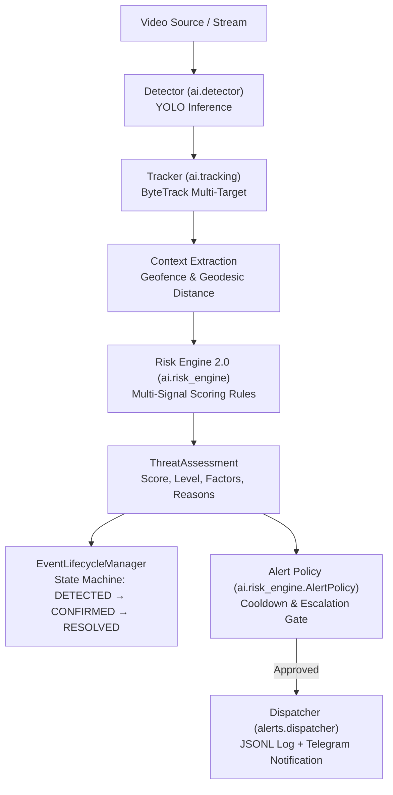

# 🐘 Project Zogan — Intelligent Threat Assessment & Risk Engine 2.0 (Phase 7)

**Document**: Risk Engine Architecture, Multi-Signal Scoring & Alert Policy  
**Version**: 2.0.0-phase7  
**Status**: Engineering Prototype Decision-Support Layer (Non-Certified)

---

## 1. Executive Summary & Core Objective

The goal of Phase 7 is to evolve Project Zogan from a simple detector:
> *"Elephant detected in camera view"*

into an intelligent, evidence-based early warning system:
> *"Based on the available evidence, how serious is this detection, why was this risk level assigned, and should an alert be dispatched?"*

Zogan 2.0 implements an **explainable, deterministic, rule-based threat assessment layer** that fuses multi-signal evidence before assigning a risk level.

---

## 2. Real vs. Simulated: Spatial Truthfulness Protocol

> [!WARNING]
> **GEOLOCATION & SENSOR DISCLAIMER**  
> * Monocular RGB cameras **cannot compute real-world GPS coordinates** without calibrated stereo, LiDAR, or depth ranging sensors.
> * **Camera GPS $\neq$ Elephant GPS**. An elephant visible in a frame is simply present in the camera's optical field-of-view.
> * Current coordinates in Project Zogan are **software-simulated** to model animal movement and spatial zone transitions.
> * **Zogan does NOT know exactly where the elephant is in the real world.**
> * Correct statement: *"Zogan can evaluate detections against configured geographic zones when location or context data is available."*

---

## 3. High-Level Architecture & Separation of Concerns

Risk assessment runs on the runtime path and is strictly separated from camera capture, inference, and alert delivery:



### Architectural Principles:
1. **The Risk Engine does NOT dispatch alerts directly**: It only evaluates evidence and produces a `ThreatAssessment`.
2. **The Risk Engine does NOT make network calls**: Zero external I/O or blocking Telegram operations inside the scoring loop.
3. **The Risk Engine does NOT require an LLM**: The core evaluation is 100% deterministic, testable, and low-latency.
4. **The Alert Policy evaluates dispatch rules**: Separates *"how dangerous is this?"* from *"should we notify rangers now?"*.

---

## 4. Multi-Signal Scoring Model

The threat score is a transparent, bounded integer from **0 to 100**.

$$\text{Threat Score} = \min\left(100, \max\left(0, \sum \text{Factor Points}\right)\right)$$

### Contributing Signals:

| Signal | Evaluation Input | Maximum Points | Description & Evidence Rules |
| :--- | :--- | :---: | :--- |
| **Zone Severity** | `VILLAGE`, `BUFFER`, `FOREST`, `OUTSIDE` | **40** | `PROTECTED/VILLAGE` (+40), `WARNING/BUFFER` (+20), `MONITORING/FOREST` (+5), `OUTSIDE` (0). |
| **Proximity Distance** | Distance to protected boundary ($d$) | **25** | $d \le 0$m (+25), $d \le 200$m (+20), $d \le 500$m (+15), $d \le 1000$m (+5), $d > 1000$m (0). |
| **Approach Trend** | Distance delta trend | **20** | `APPROACHING` (+20), `STABLE` or `UNKNOWN` (+5), `RECEDING` (0). |
| **Temporal Persistence** | Consecutive detection frames | **20** | $\ge 10$ frames (+15), $\ge 5$ frames (+10), $\ge 3$ frames (+5), $< 3$ frames (0). |
| **Herd / Group Size** | Simultaneously tracked elephants | **10** | $\ge 4$ elephants (+10), $\ge 2$ elephants (+5), 1 elephant (+2), 0 (0). |
| **Detection Confidence** | Model sustained confidence ($c$) | **10** | $c \ge 0.90$ (+10), $c \ge 0.80$ (+7), $c \ge 0.70$ (+5), $c < 0.70$ (0). |
| **Dwell Duration** | Elapsed time in elevated risk area | **10** | $\ge 30.0$s dwell (+10), $\ge 10.0$s dwell (+5), $< 10.0$s (0). |
| **Incident History** | Recent alert events in area | **5** | $\ge 3$ recent events (+5), $\ge 1$ recent event (+2), 0 (0). |

---

## 5. Risk Level Thresholds & Safeguards

Scores map deterministically to 4 standardized risk levels:

| Score Range | Risk Level | Operational Meaning | Alert Action |
| :---: | :---: | :--- | :--- |
| **0 – 24** | `LOW` | Target in forest habitat / receding / unconfirmed | Log only |
| **25 – 49** | `MEDIUM` | Target in intermediate buffer / stationary | Local HUD warning |
| **50 – 74** | `HIGH` | Confirmed target approaching boundary | Dispatched alert |
| **75 – 100** | `CRITICAL` | Confirmed target entering village perimeter | Emergency alarm |

### Critical Safety Safeguards:
1. **Single-Frame False Positive Suppression**:
   * A single noisy detection (persistence $< 5$ frames) **can NEVER produce `CRITICAL` or `HIGH`**, regardless of coordinates or confidence.
   * Risk is strictly capped at `MEDIUM` (or `LOW`), and alert dispatch is suppressed until temporal presence is confirmed.
2. **Critical Evidence Requirements**:
   * Reaching `CRITICAL` requires:
     1. Verified persistence ($\ge 5$ frames).
     2. Minimum detection confidence ($\ge 0.70$).
     3. Target inside `PROTECTED` perimeter OR within critical distance ($\le 300$m).
   * If score $\ge 75$ but evidence requirements are unmet, risk is downgraded to `HIGH`.
3. **De-escalation & Reversibility**:
   * As an elephant recedes or leaves, the evaluated score and risk level immediately decrease. The system does not remain locked in an alert state once the target subsides.

---

## 6. Explainability: The `ThreatAssessment` Model

Every risk assessment outputs a typed `ThreatAssessment` instance with human-readable, factual reasons:

```python
@dataclass
class ThreatAssessment:
    score: int  # 0 - 100 integer score
    level: str  # LOW, MEDIUM, HIGH, CRITICAL
    zone: str  # Current zone classification
    distance_to_protected: float  # Geodesic distance in meters
    trend: str  # APPROACHING, RECEDING, STABLE, UNKNOWN
    group_size: int  # Simultaneously tracked count
    confidence: float  # Model detection confidence
    contributing_factors: dict  # Explicit point breakdown per signal
    alert_recommended: bool  # Policy recommendation flag
    reasons: list[str]  # Factual explanations for the score
    detection_count: int  # Consecutive frames detected
    tracked_objects: list[int]  # Active track IDs
    duration_seconds: float  # Dwell time in risk area
    event_id: str  # Unique encounter identifier
    is_escalated: bool  # True if risk jumped to higher priority
    timestamp: str  # ISO-8601 UTC timestamp
```

### Example Real-World Assessment:
```yaml
risk_level: HIGH
risk_score: 72
confidence: 0.94
zone: WARNING (BUFFER)
distance_to_protected: 350.0m
trend: APPROACHING
group_size: 2
tracked_objects: [1, 2]

contributing_factors:
  zone_points: 20
  proximity_points: 15
  trend_points: 20
  group_points: 5
  confidence_points: 10
  persistence_points: 10

reasons:
  - "Target located in intermediate buffer warning corridor."
  - "Proximity: Close proximity (350m) to protected boundary (<500m)."
  - "Movement: Tracked movement is consistently APPROACHING protected boundary."
  - "Group size: Multiple elephants detected (2 tracked simultaneously)."
  - "Confidence: High detection confidence sustained (94.0%)."
  - "Persistence: Confirmed temporal presence sustained over 6 consecutive frames."
```

---

## 7. Stateful Event Lifecycle

The `EventLifecycleManager` maintains encounter state across video frames:

```
[IDLE]
  │ (elephant detected, frame 1)
  ▼
[DETECTED] ────────────── (missed 30 frames) ──────────────► [RESOLVED]
  │ (persistence >= 5 frames)                                   ▲
  ▼                                                             │
[CONFIRMED]                                                     │
  │ (threat elevates to HIGH / CRITICAL)                        │
  ▼                                                             │
[HIGH_RISK / CRITICAL] ── (elephant leaves for 30 frames) ──────┘
```

1. **New Event Initiation**: A unique `event_id` (`zogan-8c9f...`) is assigned on initial detection.
2. **Persistence Confirmation**: Tracks persistence counter before advancing to `CONFIRMED`.
3. **Escalation Detection**: Flags when an event jumps risk levels (e.g., `HIGH` $\to$ `CRITICAL`).
4. **Clean Resolution**: When the elephant leaves for $\ge 30$ frames (or 2.0s), the event transitions to `RESOLVED`, records total duration and peak risk, and logs a resolution entry. Future incursions spawn a new event.

---

## 8. Decoupled Alert Policy & Cooldown

The `AlertPolicy` separates assessment from dispatch decisions:

* **Cooldown Protection**: Prevents duplicate notification spam (default 30 seconds).
* **Escalation Bypass**: If a persisting event escalates from `HIGH` to `CRITICAL`, the standard cooldown is bypassed to immediately dispatch an emergency alert.
* **Fail-Safe Dispatching**: Dispatches through `alerts.dispatcher` to local `logs/alerts.jsonl` and optionally Telegram.

---

## 9. Configuration Parameters (`config/settings.py`)

All engine rules and thresholds are fully configurable:

```python
# Score thresholds
RISK_LEVEL_LOW_MAX = 24
RISK_LEVEL_MEDIUM_MAX = 49
RISK_LEVEL_HIGH_MAX = 74

# Signal point caps
MAX_ZONE_POINTS = 40
MAX_PROXIMITY_POINTS = 25
MAX_TREND_POINTS = 20
MAX_PERSISTENCE_POINTS = 20
MAX_GROUP_POINTS = 10
MAX_CONFIDENCE_POINTS = 10
MAX_DURATION_POINTS = 10
MAX_HISTORY_POINTS = 5

# Safeguards
PERSISTENCE_CONFIRMATION_FRAMES = 5
CRITICAL_REQUIRES_PERSISTENCE = True
CRITICAL_MIN_CONFIDENCE = 0.70
CRITICAL_MAX_DISTANCE_METERS = 300.0
SINGLE_FRAME_RISK_CAP = "MEDIUM"

# Policy & Lifecycle
ALERT_COOLDOWN_SECONDS = 30
ESCALATION_COOLDOWN_BYPASS = True
EVENT_RESOLUTION_FRAMES = 30
EVENT_RESOLUTION_SECONDS = 2.0
```

---

## 10. Automated Test Coverage

The test suite in `tests/test_phase7.py` covers 20 distinct verification scenarios:
1. Low-risk detection (distant forest, receding)
2. Medium-risk detection (buffer perimeter, stationary)
3. High-risk detection (buffer corridor, approaching)
4. Critical-risk detection (village settlement, 0m distance)
5. Single-frame false positive (risk capped, alert withheld)
6. Persistent detection evidence accumulation
7. Elephant leaving zone (outward retreat, score drops)
8. Elephant entering zone (inward incursion, score rises)
9. Elephant approaching protected boundary
10. Stationary elephant (stable trend points)
11. Multiple elephants (herd scoring and track list)
12. Risk decreasing when evidence subsides
13. Event lifecycle resolution & clean ID renewal
14. Alert cooldown suppression
15. Evidence-based alert escalation (cooldown bypass)
16. Deterministic scoring consistency (100 iterations)
17. Invalid and missing inputs resilience
18. Extreme confidence values clamping
19. Score clamping boundaries [0, 100]
20. Configuration overrides (custom thresholds and toggles)
